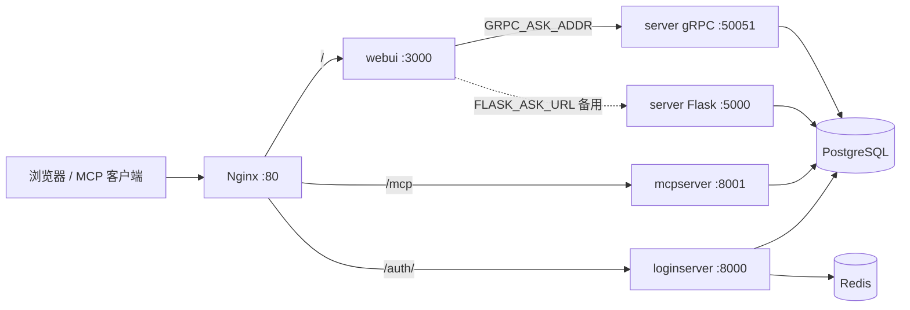

# LLM RAG 问答工程

基于 **阿里云百炼 DashScope（Qwen）** 的端到端 RAG：FAISS 向量检索、查询增强（HyDE / Query2Doc 等）、**LangGraph** 编排与多轮会话（内存或 **PostgreSQL checkpoint**）。配套 **Next.js** 聊天前端（`/api/ask` 可经 **gRPC** 或 HTTP 转发 RAG）、**FastAPI 登录与会话**、以及 **FastMCP** 暴露的 RAG 检索工具（供 Cursor 等 MCP 客户端使用）。

---

## 功能概览

- **RAG 与图编排**：`QwenRagService` 以 LangGraph **`StateGraph`**（[`rag_graph.py`](llm_common/llm_common/rag/rag_graph.py)）统一主链：FAISS 向量检索、图文块入库与检索、多模态嵌入（可选）、上下文拼装与 DashScope 对话（流式 / 非流式）均在图内完成；**查询增强**由图节点 **[`QueryEnhanceToolAgent`](llm_common/llm_common/rag/query_enhance_agent.py)** 在 **Query2Doc** 与 **HyDE** 间自动二选一（工具型 Agent）。节点顺序：**准备** → **检索查询上下文化**（多轮会话得到 `retrieval_query`）→ **查询增强** → **检索** → **检索守卫** → **生成** → **自检**（仅非流式）→ **有限次重试**（低置信时回到查询增强）→ **收尾**（写入助手消息）。**短路**：守卫发现无上下文则直接收尾；流式生成跳过自检直接收尾。
- **多轮对话**：请求参数 **`sessionId`**（GET Query 或 POST JSON）对应 LangGraph thread；生产环境可通过 `LANGGRAPH_CHECKPOINT_DB_URI` 写入 Postgres。
- **Web UI**：Next.js：对话、登录、MCP Token 配置说明。
- **账号体系**：邮箱验证码登录（OTP）、Redis 会话、Postgres 持久化；JWT 子路由；**MCP 访问令牌**（`/auth/mcp-token`）与 RSA 配置表 `mcp_jwt_config`。
- **MCP**：JWT 鉴权后暴露 `retrieve_rag_contexts`（可选手动指定 `query2doc` / `hyde`）。


---

## 系统架构



| 服务 | 镜像/构建 | 说明 |
|------|-----------|------|
| **server** | `server/Dockerfile` | Gunicorn 运行 `ollama_qwen:app`，端口 **5000**；并行 **gRPC** `AskService`，端口 **50051**（[`run_services.sh`](server/run_services.sh)） |
| **webui** | `webui/Dockerfile` | Next.js 16，端口 **3000** |
| **loginserver** | `loginserver/Dockerfile` | FastAPI + Uvicorn，宿主机 **8000** |
| **mcpserver** | `mcpserver/Dockerfile` | `llm-mcp`（FastMCP streamable-http），宿主机 **8001** |
| **postgres** | `postgres:16-alpine` | 用户/库默认 `loginserver`，数据卷 `loginserver_pg_data` |
| **redis** | `redis:7-alpine` | loginserver 会话与验证码等 |
| **nginx** | `nginx:1.27-alpine` | 宿主机 **80**，挂载 `nginx/default.conf` |

**共享 Python 包**：[`llm_common`](llm_common/)（被 server、loginserver、mcpserver 以可编辑或路径依赖方式引用）。

---

## 仓库目录

| 路径 | 内容 |
|------|------|
| [`llm_common/`](llm_common/) | 共享库：`rag/`（`qwen_rag_service`、`rag_graph`、`vector_db`、`embedding_provider`、`dashscope_llm` 等）、`postgres_store.py`、`mcp_jwt_dao.py`、`paths.py` |
| [`server/`](server/) | Flask 入口 [`ollama_qwen.py`](server/ollama_qwen.py)、[`grpc_ask_server.py`](server/grpc_ask_server.py)、[`ask_handlers.py`](server/ask_handlers.py)、[`run_services.sh`](server/run_services.sh)、`vectorstore/`、`pdf/`、索引脚本 [`pdf_to_chroma.py`](server/pdf_to_chroma.py)、[`check_ollama_embed.py`](server/check_ollama_embed.py) |
| [`proto/`](proto/) | [`ask.proto`](proto/ask.proto)：`AskService`（`AskStream` / `AskOnce`） |
| [`webui/`](webui/) | Next.js App Router，[`src/app/api/ask/route.ts`](webui/src/app/api/ask/route.ts) 代理后端 |
| [`loginserver/`](loginserver/) | [`loginserver.py`](loginserver/loginserver.py)、`jwt_api`、`mcp_token_api`、`dao/` |
| [`mcpserver/`](mcpserver/) | [`llm_mcpserver/mcpserver.py`](mcpserver/llm_mcpserver/mcpserver.py)，工具 `retrieve_rag_contexts` |
| [`nginx/`](nginx/) | [`default.conf`](nginx/default.conf)，日志目录 `nginx/logs/` |
| [`docker-compose.yml`](docker-compose.yml) | 本地构建编排；固定子网 `172.28.240.0/24` |
| [`docker-compose.aliyun.yml`](docker-compose.aliyun.yml) | 使用 ACR 镜像变量拉取预构建镜像 |
| [`deploy-aliyun.sh`](deploy-aliyun.sh) | 构建并推送 webui/server/loginserver/mcpserver/nginx 至 ACR，可选 SSH 同步 compose 到 ECS（用法见脚本顶部注释） |
| [`uidesign/`](uidesign/) | 静态设计稿等 |

**数据库迁移**：无 Alembic；首次启动由 `init_postgres` + SQLAlchemy `create_all` 创建表（见 loginserver lifespan 与 mcpserver 启动逻辑）。

---

## HTTP API

### Flask `server` — [`server/ollama_qwen.py`](server/ollama_qwen.py)

| 路由 | 说明 |
|------|------|
| `GET/POST /ask` | 参数 **`query`**（必填）；**`stream`** 默认 `true`：`false` 时返回 JSON（`ask_once`）；**`trace`** 可选；多轮会话传 **`sessionId`**（GET Query 或 POST JSON）。响应体 JSON（非流式）或流式首包 JSON 中的 **`sessionId`** 带回 LangGraph thread id；**不**再通过响应头传递会话 id。 |
| `GET /` | `{"status":"ok"}` 健康检查 |

**流式模式**（`stream=true`）：`Content-Type: application/octet-stream`，首段为魔数 `RAG\x01` + 4 字节大端 JSON 长度 + UTF-8 JSON（含 `contexts`、`sessionId`，可选 `trace`），随后为回答 token 的 UTF-8 字节流。

**本地开发**：`python server/ollama_qwen.py serve`，默认 `FLASK_HOST`/`FLASK_PORT` 可调。

### gRPC `AskService` — [`proto/ask.proto`](proto/ask.proto)、[`server/grpc_ask_server.py`](server/grpc_ask_server.py)

与 Flask **`/ask`** 同一套 RAG 逻辑（[`server/ask_handlers.py`](server/ask_handlers.py)）。默认监听 **`GRPC_BIND`**（默认 `0.0.0.0`）+ **`GRPC_PORT`**（默认 **50051**）。

| RPC | 说明 |
|-----|------|
| `AskStream` | `AskRequest`：`query`、`stream`、`trace`、`session_id`（对应 HTTP `sessionId`）；响应为流式 `AskStreamChunk.body_chunk`，拼接后与 HTTP 流式体格式一致。 |
| `AskOnce` | 同上请求；`AskOnceResponse.json_body` 为非流式 JSON 字节（与 `stream=false` 的 `/ask` 一致）。 |

**生成 Python stub**（在仓库根目录，输出目录需与 `grpc_ask_server` 的 import 一致，见 [`command.txt`](command.txt)）：

```bash
python -m grpc_tools.protoc -I. --python_out=server/grpc_generated --grpc_python_out=server/grpc_generated proto/ask.proto
```

**单独启动 gRPC**（已安装 `server` 依赖、`PYTHONPATH` 含 `llm_common` 时）：`cd server && python grpc_ask_server.py`。

### loginserver — 前缀以部署为准

经 Nginx 时为 **同源 `/auth/...`**；直连 loginserver 时为 **`http://127.0.0.1:8000/auth/...`**（与 [`webui/src/lib/authBaseUrl.ts`](webui/src/lib/authBaseUrl.ts) 默认一致）。

| 路由 | 说明 |
|------|------|
| `GET /health` | 健康检查 |
| `POST /auth/send-code` | 发送邮箱验证码（邮件发送逻辑在源码中可能注释，调试可看 `ENABLE_DEBUG_CODE`） |
| `POST /auth/login` | OTP 登录，返回会话令牌 |
| `GET /auth/me` | 当前用户 |
| `POST /auth/logout` | 登出 |
| `POST/GET /auth/mcp-token` | MCP 客户端配置与令牌（需登录 middleware） |
| `/auth/jwt/*` | JWT 子路由（见 `jwt_api`） |

### WebUI — Next.js

| 路径 | 说明 |
|------|------|
| [`src/app/page.tsx`](webui/src/app/page.tsx) | 聊天主页 |
| [`src/app/settings/`](webui/src/app/settings/) | 设置页（含 MCP Token 区块） |
| `POST /api/ask` | 服务端 RAG 代理：**gRPC**（**`GRPC_ASK_ADDR`**，如 `server:50051`）与 **HTTP**（**`FLASK_ASK_URL`**）的具体选用逻辑见 [`route.ts`](webui/src/app/api/ask/route.ts)。体字段 `query`、`stream`、可选 `sessionId`；流式时 **`sessionId`** 在首包 JSON 中（不依赖响应头）。 |

详见 [webui/README.md](webui/README.md)。

### MCP — `mcpserver`

- **传输**：`streamable-http`，监听 `0.0.0.0:8001`，路径 **`/mcp`**。
- **工具**：`retrieve_rag_contexts(query, k, enhance_strategy)` → 与 `QwenRagService.retrieve_context` 一致。
- **鉴权**：Bearer JWT，公钥与 `issuer`/`audience` 与表 `mcp_jwt_config` 一致；可通过环境变量 `MCP_JWT_ISSUER`、`MCP_JWT_AUDIENCE` 影响首启写入默认值。

经 Nginx 访问：**`http://<host>/mcp`**。对外分发 MCP 配置时需设置 **`MCP_SERVER_URL`**（如 `https://你的域名/mcp`）。

---

## Nginx 路由摘要

[`nginx/default.conf`](nginx/default.conf)：

- **`/`** → `webui:3000`（长超时、关闭代理缓冲、每 IP 约 10 req/s 限流）
- **`/auth/`** → `loginserver:8000`
- **`/mcp`**、**`/mcp/`** → `mcpserver:8001`（精确区分，避免前缀误匹配）

---

## 环境变量（按关注点）

### 根目录 `.env`（server / mcpserver 通过 Compose `env_file` 加载）

| 变量 | 说明 |
|------|------|
| `DASHSCOPE_API_KEY` | 百炼 API Key（必填） |
| `DASHSCOPE_BASE_HTTP_API_URL` | 可选，HTTP 基址 |
| `DASHSCOPE_CHAT_MODEL` / `DASHSCOPE_VL_MODEL` | 对话 / 多模态模型（见 `ollama_qwen.py` 模块注释） |
| `LANGGRAPH_CHECKPOINT_DB_URI` | Postgres 连接串；未设置则用内存 checkpoint |
| `LANGGRAPH_CHECKPOINT_POOL_MAX` | checkpoint 连接池大小，默认 `5` |
| `MCP_JWT_ISSUER` / `MCP_JWT_AUDIENCE` | mcpserver / `mcp_jwt_config` 默认值 |

### Compose 内联（`docker-compose.yml`）

- **webui**：`FLASK_ASK_URL=http://server:5000/ask`，`GRPC_ASK_ADDR=server:50051`，`NEXT_PUBLIC_AUTH_BASE_URL=/auth`
- **loginserver**：`REDIS_URL`、`PG_*`、`ALLOWED_ORIGINS`、`ENABLE_DEBUG_CODE`、**`MCP_SERVER_URL`**
- **mcpserver**：`PG_*`（与 postgres 服务一致）

嵌入后端默认在代码中指向 DashScope 多模态向量；若改用 Ollama，需调整 [`llm_common/llm_common/rag/embedding_provider.py`](llm_common/llm_common/rag/embedding_provider.py) 中的 `DEFAULT_EMBED_MODEL_NAME` 等常量，并保证 Ollama 可访问（Docker 内需额外网络或 host 配置）。

---

## Docker Compose 启动

```bash
# 仓库根目录：创建 .env，至少写入 DASHSCOPE_API_KEY=...
docker compose up --build -d
```

- 前端与网关：<http://localhost>
- loginserver：<http://localhost:8000>
- MCP 直连：<http://localhost:8001/mcp>；经网关：<http://localhost/mcp>

**数据目录**：`server/vectorstore`、`server/pdf` 挂载到 **server**；**mcpserver** 挂载 `server/vectorstore` 以共享 FAISS 索引。

**构建注意**：`python:3.12-slim` 无系统 libpq，`llm_common` 声明 **`psycopg[binary]`**，供 LangGraph Postgres checkpoint 使用；[`mcpserver/Dockerfile`](mcpserver/Dockerfile) 使用国内 PyPI 镜像与较长 pip 超时，降低大 wheel 下载失败率。

### 阿里云镜像

使用 [`docker-compose.aliyun.yml`](docker-compose.aliyun.yml)，设置 `ACR_REGISTRY`、`ACR_NAMESPACE`、`IMAGE_TAG` 等。构建推送可参考 [`deploy-aliyun.sh`](deploy-aliyun.sh) 顶部 **Usage**（脚本内请勿提交真实账号/密钥，按需本地覆盖环境变量执行）。

---

## 本地开发（无 Docker）

**Python 3.12+**：

```bash
python -m venv .venv && source .venv/bin/activate  # Windows: .venv\Scripts\activate
pip install -e ./llm_common
pip install -r server/requirements.txt
# loginserver
pip install -r loginserver/requirements.txt
# mcpserver（在 mcpserver 目录）
cd mcpserver && pip install -e . && cd ..
```

1. 根目录 `.env` 配置 `DASHSCOPE_API_KEY` 等。  
2. 启动 Postgres / Redis（或与 compose 只起依赖服务）。  
3. RAG API：`python server/ollama_qwen.py serve`  
4. loginserver：在 `loginserver` 目录按项目习惯启动 uvicorn（需 `PG_*`、`REDIS_URL`）。  
5. 前端：`cd webui && npm install && npm run dev`，设置 `FLASK_ASK_URL`、`NEXT_PUBLIC_AUTH_BASE_URL`；若本地已起 gRPC，可设 `GRPC_ASK_ADDR=127.0.0.1:50051`（见 [`webui/src/app/api/ask/route.ts`](webui/src/app/api/ask/route.ts)）。Proto 生成：`cd webui && npm run proto:gen`。

索引 PDF 等可使用 `server/pdf_to_chroma.py`；验证 Ollama 嵌入可用 **`python server/check_ollama_embed.py`**。

---

## 技术栈摘要

- **后端**：Flask、Gunicorn、gRPC（`grpcio` / `grpc.aio`）、FastAPI、Uvicorn、SQLAlchemy、asyncpg、LangChain / LangGraph、FastMCP、DashScope SDK、FAISS（`faiss-cpu`）。  
- **前端**：Next.js 16、React 19、Tailwind CSS 4、TypeScript。  
- **基础设施**：PostgreSQL 16、Redis 7、Nginx。

---


## 版本说明

- **v1.1.0**：**用户登录**（`loginserver` + Redis + PostgreSQL）；RAG 使用 **LangGraph**（`rag_graph`：检索、守卫、自检与重试）。
- **v1.0.0**：RAG 主要基于 **LangChain** 链式组装。

---

## 许可证与外部服务

本项目采用 **`GPL-3.0-or-later`**，见仓库根目录 **`LICENSE`**。  

使用 DashScope、Ollama 等平台时，请遵守各服务商条款与计费规则。  

**文档与代码不一致时，以当前仓库实现为准。**
