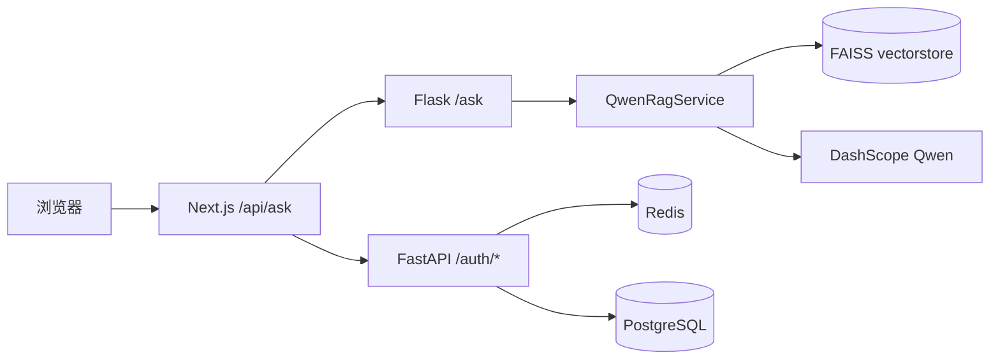
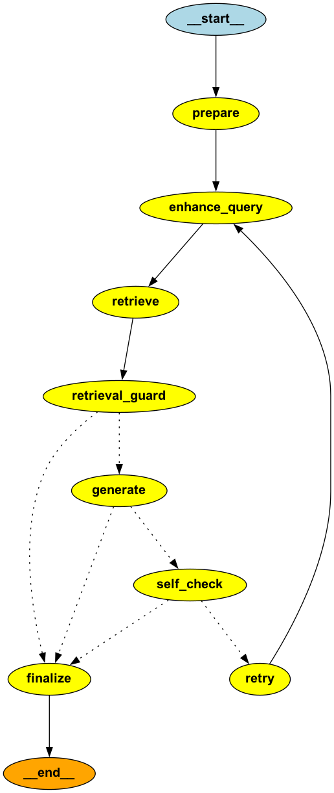

# LLM 本地 RAG 问答工程

基于 **向量检索（FAISS）+ 阿里云百炼 DashScope（Qwen 对话）** 的问答系统：将 PDF 等文档入库后，用户通过 Web 聊天界面提问，后端检索相关片段并生成回答；支持流式输出与检索引用展示。嵌入层可配置为 **DashScope 多模态向量** 或 **Ollama 嵌入模型**（见 `embedding_provider.py` 中的 `DEFAULT_EMBED_MODEL_NAME` 与分支逻辑）。

---

## 功能概览

| 能力 | 说明 |
|------|------|
| RAG 问答 | 从本地 FAISS 向量库检索上下文，再调用 Qwen 模型生成答案 |
| 查询增强 | 支持 `query2doc`（默认）、`hyde` 等策略（见 `server/query_enhance.py`） |
| LangGraph 编排 | 使用 `StateGraph` 串联检索、守卫、自检与重试节点（见 `server/rag_graph.py`） |
| 多模态 | 检索结果可含图片引用；对话侧可按需使用视觉模型（见 `qwen_rag_service` / 环境变量） |
| 流式响应 | Flask 端自定义流式协议；前端 `readRagStreamBody` 解析引用与正文增量 |
| Web UI | 侧栏场景切换、Markdown 渲染、引用来源、本地保存会话（localStorage） |

---

## 仓库结构

```
llm/
├── server/                 # Python 后端与 RAG 核心
│   ├── ollama_qwen.py      # Flask 入口：/ask 等 HTTP API
│   ├── qwen_rag_service.py # 检索、消息构造、调用 DashScope LLM
│   ├── rag_graph.py        # LangGraph RAG 流程编排（含 guard/self-check/retry）
│   ├── dashscope_llm.py    # 百炼客户端封装
│   ├── vector_db.py        # FAISS 向量库封装（默认 vectorstore）
│   ├── embedding_provider.py # 嵌入模型选择与缓存
│   ├── pdf_to_chroma.py    # PDF 解析、分块、写入向量库
│   ├── query_enhance.py    # 查询增强策略
│   └── …                   # 其它工具与测试脚本
├── webui/                  # Next.js 16 前端
│   └── src/
│       ├── app/            # App Router、api/ask 代理
│       ├── components/chat/# 聊天布局与消息、引用、输入框
│       ├── hooks/useChat.ts
│       └── lib/            # 流式解析、常量等
├── loginserver/            # FastAPI 登录服务（邮箱验证码 + 会话/JWT）
│   ├── loginserver.py      # 认证 API 入口
│   ├── redis_store.py      # Redis 键与客户端封装
│   ├── postgres_store.py   # 会话持久化（PostgreSQL）
│   └── requirements.txt
├── server/requirements.txt # Python 依赖
├── .env                    # 密钥与模型配置（需自行创建，勿提交）
├── pdf/                    # 待入库 PDF（按需创建）
└── server/vectorstore/     # FAISS 持久化目录（运行 pdf 脚本后生成）
```

---

## 架构说明

1. **数据面**：`pdf_to_chroma.py` 读取 `pdf/` 下文档，分块（含语义分块等）后，用 `EmbeddingProvider` 指定模型做向量，写入 `server/vectorstore`（FAISS）。
2. **流程编排**：`QwenRagService` 基于 `rag_graph.py` 构建 LangGraph，节点顺序为：`prepare -> enhance_query -> retrieve -> retrieval_guard -> generate -> self_check -> (retry|finalize)`。
3. **检索与守卫**：支持文本/向量检索两条路径，`retrieval_guard` 在无上下文时快速拒答，避免无依据生成。
4. **生成与自检**：`generate` 负责组装消息并调用 `DashScopeLLMClient`，`self_check` 按置信度触发一次回退重试（HyDE 自动回退 `query2doc`）。
5. **前端**：浏览器只访问 Next.js；`POST /api/ask` 由 Route Handler 转发到 Flask `POST /ask`，并透传流式 body。



LangGraph 实际流程图（由代码导出）：



---

## 环境准备

### Python

- Python 3.10+（项目 `server/requirements.txt` 注明兼容 faiss 与较新版本）
- 虚拟环境建议放在仓库根目录 `.venv`

```bash
cd /path/to/llm
python -m venv .venv
.venv/bin/pip install -r server/requirements.txt
```

### 必需配置

- 在项目根目录创建 **`.env`**（可参考 `server/ollama_qwen.py` 头部注释）：
  - **`DASHSCOPE_API_KEY`**：百炼对话与（若使用）DashScope 嵌入所必需
  - 可选：`DASHSCOPE_CHAT_MODEL`、`DASHSCOPE_VL_MODEL`、`DASHSCOPE_BASE_HTTP_API_URL` 等

### 向量库与嵌入

- **入库**：配置好 `.env` 与 `pdf/` 后执行 `pdf_to_chroma` 相关流程（见该文件顶部说明），生成 `server/vectorstore`。
- **嵌入**：默认逻辑见 `embedding_provider.py`（如 DashScope `tongyi-embedding-vision-plus` 或 Ollama 模型名）；若用 Ollama，需本机运行并 `ollama pull` 对应嵌入模型。

### 前端

```bash
cd webui
npm install
```

---

## 运行方式

### 1. 启动 Flask 后端

在 **`server` 目录**下运行，保证模块导入路径正确：

```bash
cd /path/to/llm/server
../.venv/bin/python ollama_qwen.py serve
```

默认监听 **`http://127.0.0.1:5000`**，`POST /ask` 接收 JSON：`query`、`stream`（可选）、`strategy`（可选，如 `query2doc` / `hyde`）。

生产部署建议使用 Gunicorn，而不是 Flask 内置开发服务器，例如：

```bash
cd /path/to/llm/server
../.venv/bin/gunicorn --bind 0.0.0.0:5000 --workers 2 --threads 4 --timeout 600 ollama_qwen:app
```

### 2. 启动 Next.js 前端

```bash
cd /path/to/llm/webui
npm run dev
```

浏览器访问 **http://localhost:3000**。

### 3. 代理地址

前端 `src/app/api/ask/route.ts` 将请求转发到环境变量 **`FLASK_ASK_URL`**，未设置时默认为 `http://127.0.0.1:5000/ask`。

### 4. Docker Compose 部署

项目提供两套 Compose 文件：

- `docker-compose.yml`：本地构建镜像并启动（适合开发机/单机）
- `docker-compose.aliyun.yml`：从阿里云 ACR 拉取镜像并启动（适合服务器）

容器链路说明：

- `server`：Python Flask API（Gunicorn 监听 `5000`）
- `webui`：Next.js 前端（通过 `FLASK_ASK_URL=http://server:5000/ask` 调用后端）
- `loginserver`：FastAPI 登录服务（监听 `8000`，由 Nginx 通过 `/auth/*` 反代）
- `nginx`：对外暴露 `80` 端口并反向代理到 `webui`
- `redis`：验证码、会话、JWT 黑名单
- `postgres`：会话持久化数据

#### 4.1 本地 Compose（`docker-compose.yml`）

首次启动前请确认：

- 根目录存在 `.env`，且至少配置 `DASHSCOPE_API_KEY`
- 待入库文档放在 `server/pdf/`
- 首次运行若无向量库，可在容器中执行入库脚本生成 `server/vectorstore/`

启动与查看日志：

```bash
docker compose up -d --build
docker compose logs -f server webui nginx
```

首次生成向量库（按需执行）：

```bash
docker compose exec server python pdf_to_chroma.py
```

常用运维命令：

```bash
# 重启某个服务
docker compose restart server

# 仅重建并更新某个服务
docker compose up -d --build server

# 停止并删除容器/网络（保留挂载数据）
docker compose down
```

#### 4.2 阿里云 Compose（`docker-compose.aliyun.yml`）

该方案适用于“本地构建并推送到 ACR，服务器仅拉取运行”：

1) 本地构建 + 推送镜像（可选同时远程部署）：

```bash
ACR_REGISTRY=registry.cn-hangzhou.aliyuncs.com \
ACR_NAMESPACE=<你的命名空间> \
IMAGE_TAG=v1.0.0 \
DOCKER_PLATFORM=linux/amd64 \
./deploy-aliyun.sh
```

2) 服务器部署（手动方式）：

```bash
mkdir -p /opt/llm
# 上传 docker-compose.aliyun.yml 到服务器并改名为 docker-compose.yml
# 上传 .env 到 /opt/llm/.env
cd /opt/llm
export ACR_REGISTRY=registry.cn-hangzhou.aliyuncs.com
export ACR_NAMESPACE=<你的命名空间>
export IMAGE_TAG=v1.0.0
docker compose pull
docker compose up -d
```

3) 服务器更新版本：

```bash
export IMAGE_TAG=v1.0.1
docker compose pull
docker compose up -d
```

---

## Login Server（认证服务）

`loginserver` 是独立的 FastAPI 服务，负责邮箱验证码登录和会话管理，默认由 Nginx 通过同源路径 `/auth/*` 暴露给前端。

### 主要能力

- 邮箱验证码发送与校验（`/auth/send-code`、`/auth/login`）
- 有状态会话（Redis 存会话，PostgreSQL 持久化会话）
- JWT 登录模式（`/auth/jwt/login`）与黑名单退出（Redis）
- 登录态查询与退出（会话模式 + JWT 模式）

### 关键环境变量

| 变量 | 默认值 | 说明 |
|------|--------|------|
| `REDIS_URL` | `redis://redis:6379/0` | Redis 连接地址 |
| `PG_HOST` | `postgres` | PostgreSQL 主机 |
| `PG_PORT` | `5432` | PostgreSQL 端口 |
| `PG_USER` / `PG_PASSWORD` / `PG_DATABASE` | - | PostgreSQL 账号信息 |
| `CODE_EXPIRE_SECONDS` | `60` | 验证码有效期（秒） |
| `SESSION_EXPIRE_SECONDS` | `604800` | 会话 token 有效期（秒） |
| `JWT_SECRET` | `replace-me-in-production` | JWT 签名密钥（生产必须覆盖） |
| `JWT_ALGORITHM` | `HS256` | JWT 算法 |
| `JWT_EXPIRE_SECONDS` | `7200` | JWT 有效期（秒） |
| `ALLOWED_ORIGINS` | `*` | CORS 白名单（逗号分隔） |
| `ENABLE_DEBUG_CODE` | `1` | 开发调试时可在响应中返回验证码（生产建议 `0`） |
| `SMTP_*` / `MAIL_FROM` | 空 | 邮件发送配置（不配置则无法真实发信） |

### 接口列表（`/auth`）

| 方法 | 路径 | 说明 |
|------|------|------|
| `POST` | `/auth/send-code` | 发送验证码（开发模式可返回 `code`） |
| `POST` | `/auth/login` | 会话模式登录，返回 `token` |
| `GET` | `/auth/me` | 会话模式查询当前用户 |
| `POST` | `/auth/logout` | 会话模式退出登录 |
| `POST` | `/auth/jwt/login` | JWT 模式登录，返回 `access_token` |
| `GET` | `/auth/jwt/me` | JWT 模式查询当前用户 |
| `POST` | `/auth/jwt/logout` | JWT 模式退出（加入黑名单） |
| `GET` | `/health` | 服务健康检查 |

请求鉴权：

- 会话模式和 JWT 模式都使用 `Authorization: Bearer <token>`。
- JWT 模式退出后，token 会写入 Redis 黑名单直到自然过期。

### 本地单独启动（可选）

```bash
cd /path/to/llm/loginserver
../.venv/bin/pip install -r requirements.txt
../.venv/bin/uvicorn loginserver:app --host 0.0.0.0 --port 8000 --reload
```

---

## HTTP 接口摘要（Flask）

| 方法 | 路径 | 说明 |
|------|------|------|
| GET | `/ask?query=...` | 查询参数提问 |
| POST | `/ask` | Body：`{"query":"...", "stream": true, "strategy": "query2doc"}` |

流式模式下，响应为自定义二进制流：先下发检索引用等 JSON，再增量输出正文 token（详见 `ollama_qwen.py` 中协议注释）。

---

## 前端技术栈

- **Next.js** 16（App Router）、**React** 19、**TypeScript**
- **Tailwind CSS** 4（`@tailwindcss/postcss`）
- **react-markdown** + **remark-gfm**（助手消息 Markdown）

更细的前端运行与接口说明见 **`webui/README.md`**。

---

## 常见问题提示

- **502 / 嵌入失败**：检查 `DASHSCOPE_API_KEY`、网络与配额；若使用 Ollama 嵌入，确认 `ollama` 服务与模型已就绪（代码内对部分 502 有重试与错误提示）。
- **OpenMP 冲突**：入口脚本已设置 `KMP_DUPLICATE_LIB_OK`；若仍报错，需排查本机多份 `libomp`。
- **无法连接后端**：确认 Flask 已启动，且 `FLASK_ASK_URL` 与实际上游地址一致。

---

## 历史版本说明

- **v1.1.0**：新增 **用户登录**（`loginserver` FastAPI：邮箱验证码、会话/JWT，依赖 Redis 与 PostgreSQL；前端登录/登出与导航整合见 `webui`）；RAG 侧引入 **LangGraph** 进行图编排（`server/rag_graph.py` 中 `StateGraph`：检索、守卫、自检与重试等节点），替代此前仅基于 LangChain 链式组装的流程。
- **v1.0.0**：RAG 流程基于 **LangChain** 实现。

---

## 许可证与说明

本项目采用 `GPL-3.0-or-later` 开源协议，详见仓库根目录 `LICENSE`。
使用 DashScope、Ollama 等外部服务时，请遵守各平台条款与计费规则。
