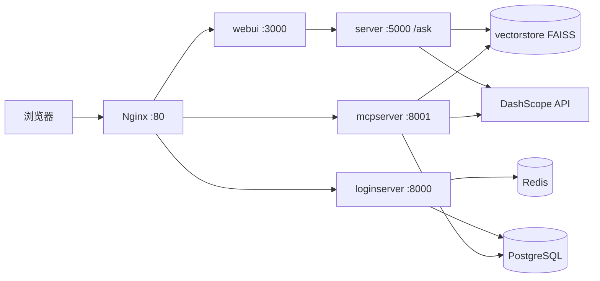

# LLM RAG 问答平台

基于 **阿里云百炼 DashScope（Qwen）** 与 **LangChain / LangGraph** 的检索增强生成（RAG）系统：提供 Web 对话、邮箱验证码登录，以及 **MCP（Model Context Protocol）** 检索工具，便于 IDE 与其它 Agent 复用同一套向量库与检索逻辑。

**运行要求**：Python **≥ 3.12**（见 `llm_common/pyproject.toml`）；根目录 `.env` 至少配置 `DASHSCOPE_API_KEY` 及嵌入相关变量（见下文）。

---

## 功能概览

| 能力 | 说明 |
|------|------|
| **RAG 问答** | FAISS 向量检索、多模态嵌入（可选）、图文块入库与检索 |
| **查询增强** | Web `/ask` 主链路由 **`QueryEnhanceToolAgent`** 在 **Query2Doc** 与 **HyDE** 间自动二选一（LangGraph 工具型 Agent） |
| **图编排** | `StateGraph`：准备 → 查询增强 → 检索 → 检索守卫 → 生成 → 自检与有限次重试 |
| **Web UI** | Next.js：对话、登录、MCP Token 配置说明 |
| **账号体系** | 邮箱验证码、Redis、PostgreSQL、Session / JWT |
| **MCP** | JWT 鉴权后暴露 `retrieve_rag_contexts`（可选手动指定 `query2doc` / `hyde`） |

---

## 仓库结构

| 目录 / 文件 | 说明 |
|-------------|------|
| `llm_common/` | 可安装包 **`llm-common`**：RAG 服务、向量库、嵌入、查询增强、DashScope 客户端、路径与 DB 相关工具 |
| `server/` | Flask **`/ask`**、Gunicorn 镜像；`server/pdf` 放待索引 PDF；`server/vectorstore` 持久化 FAISS |
| `server/pdf_to_chroma.py` | 从 `server/pdf` 构建/更新向量库（混合分块、可选页内图片多模态向量） |
| `webui/` | Next.js 前端（[`webui/README.md`](webui/README.md)） |
| `loginserver/` | FastAPI：登录、MCP 配置下发（`MCP_SERVER_URL`） |
| `mcpserver/` | FastMCP：RAG 检索工具 |
| `nginx/` | 反代：`/` → WebUI，`/auth/` → loginserver，`/mcp` → mcpserver |
| `docker-compose.yml` | 本地构建各服务 |
| `docker-compose.aliyun.yml` | 云上从 ACR 拉镜像 |
| `deploy-aliyun.sh` | 构建、推送 ACR、可选远程启动 |

### `llm_common.rag` 模块索引（便于读代码）

| 模块 | 职责 |
|------|------|
| `qwen_rag_service.py` | `QwenRagService`：`ask_once` / `ask_stream`（走 LangGraph）、`retrieve_context`（MCP 用，固定策略） |
| `rag_graph.py` | 编译 RAG 状态图：节点与条件边 |
| `query_enhance_agent.py` | `QueryEnhanceToolAgent`：工具调用在 Query2Doc / HyDE 间择一 |
| `query_enhance.py` | `Query2DocStrategy`、`HyDEStrategy`、`get_strategy` |
| `vector_db.py` | FAISS 封装与持久化 |
| `embedding_provider.py` | 嵌入模型选择（DashScope 多模态 / Ollama 等） |
| `dashscope_llm.py` | DashScope 对话客户端 |

---

## 架构概览



- **server**、**mcpserver** 读取仓库根目录 **`.env`**（对话密钥、嵌入等）。
- **loginserver**、**mcpserver** 共用 **PostgreSQL**（用户数据、MCP JWT 公钥与 issuer/audience 等）。
- 浏览器经同源 **`/auth/*`** 访问登录；MCP 客户端使用可公网访问的 **`https://你的域名/mcp`**（由 nginx 转发；compose 通过 **`MCP_SERVER_URL`** 写给前端）。

### RAG 主链路（Web `/ask`）简要流程

1. **prepare**：规范化 `query`、`k`、重试上限等。  
2. **enhance_query**：`QueryEnhanceToolAgent` 调用唯一工具，得到文本检索向量或 HyDE 融合向量。  
3. **retrieve**：按文本或向量检索 FAISS，合并同页图片等。  
4. **retrieval_guard**：无上下文时短路为拒答文案。  
5. **generate**：组装消息并调用 DashScope（流式或非流式）。  
6. **self_check** / **retry**：低置信度时有限次回到 **enhance_query**。

开启 **`trace`** 时，轨迹中含 **`retrieval_mode`**：`text` 对应 Query2Doc 路径，`vector` 对应 HyDE 路径。

---

## 知识库构建

1. 将 PDF 放入 **`server/pdf`**（可子目录；与 `docker-compose` 挂载一致）。  
2. 配置根目录 **`.env`**（含 `DASHSCOPE_API_KEY`；多模态嵌入见 `embedding_provider`）。  
3. 安装依赖后执行：

```bash
cd /path/to/llm
source .venv/bin/activate
pip install -r server/requirements.txt
python server/pdf_to_chroma.py
```

向量与清单写入 **`server/vectorstore`**（容器内为 `/app/server/vectorstore`）。**server** 与 **mcpserver** 需挂载同一目录以共用索引。

---

## 环境变量（常见）

在项目**根目录**维护 **`.env`**。下表为常见项，**以代码为准**。

| 变量 | 用途 |
|------|------|
| `DASHSCOPE_API_KEY` | 百炼 DashScope |
| `DASHSCOPE_CHAT_MODEL` / `DASHSCOPE_VL_MODEL` / `DASHSCOPE_BASE_HTTP_API_URL` | 对话 / 多模态模型与 HTTP 基址（可选） |
| 嵌入相关 | `EmbeddingProvider`（如 DashScope 多模态或 Ollama，见 `llm_common.rag.embedding_provider`） |
| `MCP_SERVER_URL` | 返回给前端的 MCP 绝对 URL（生产建议 `https://域名/mcp`） |
| `MCP_JWT_ISSUER` / `MCP_JWT_AUDIENCE` | MCP JWT 默认声明（可与 DB 配置对齐） |

**loginserver** 另需 **`REDIS_URL`**、**`PG_*`**、可选 **`SMTP_*`**；`docker-compose.yml` 中带开发默认值。

---

## 本地开发

### 1. RAG API（Flask）

`server/requirements.txt` 已包含 **`-e ../llm_common`**，安装时会拉取共享包。

```bash
cd /path/to/llm
python -m venv .venv
source .venv/bin/activate
pip install -r server/requirements.txt
cd server
python ollama_qwen.py serve
```

默认 **`http://127.0.0.1:5000`**；健康检查 **`GET /`**。

### 2. 前端

```bash
cd webui
npm install
npm run dev
```

访问 **`http://localhost:3000`**。Next.js 通过 **`FLASK_ASK_URL`** 将 **`POST /api/ask`** 转发到 Flask **`/ask`**（默认 `http://127.0.0.1:5000/ask`）。

### 3. 登录服务（可选）

```bash
cd loginserver
pip install -r requirements.txt
uvicorn loginserver:app --host 0.0.0.0 --port 8000 --reload
```

需本机 **Redis**、**PostgreSQL** 与环境变量与 compose 或本地配置一致。

### 4. MCP 服务（可选）

```bash
cd mcpserver
pip install -e .
python -m llm_mcpserver.mcpserver
```

或使用入口脚本 **`llm-mcp`**（见 `mcpserver/pyproject.toml`）。客户端示例：**`mcpserver/test_mcpclient.py`**。

---

## HTTP API：`/ask` 摘要

- **路径**：`GET` / `POST` **`/ask`**  
- **参数**：`query`（必填）、`stream`（默认流式）、`trace`（可选调试轨迹）。  
- **说明**：**不再**通过请求参数固定 `query2doc` / `hyde`；由图内 Agent 自动选择增强方式。  
- **流式**：自定义二进制帧：魔数 **`RAG\x01`** + JSON 引用块 + UTF-8 正文分片（详见 **`server/ollama_qwen.py`** 注释）。

---

## MCP 工具说明

- **`retrieve_rag_contexts`**：对 `QwenRagService.retrieve_context` 的封装。  
- 参数 **`enhance_strategy`**： **`query2doc`** 或 **`hyde`**，由调用方**手动**指定（与 Web 主链路的 Agent 调度不同）。  
- 返回 **`prompt_context`** 与序列化 **`contexts`**，供下游 LLM 使用。

---

## Docker Compose（一体运行）

在**仓库根目录**：

```bash
docker compose up -d --build
```

- 入口：**Nginx `http://localhost:80`**  
- loginserver 映射 **`8000`**（调试）；mcpserver **`8001`**（生产 MCP 通常只经 **`/mcp`**）  
- 卷：**PostgreSQL** 数据；**`./server/vectorstore`**、**`./server/pdf`** 挂载到 server；mcpserver 挂载 **vectorstore**

---

## 阿里云部署

1. 使用 **`deploy-aliyun.sh`** 构建并推送 **webui / server / loginserver / mcpserver / nginx** 到 ACR（脚本内注释含变量示例）。  
2. 在 ECS 配置 **`.env`**、**`MCP_SERVER_URL`**（HTTPS 域名 + `/mcp`）、**`docker-compose.aliyun.yml`** 与 **`IMAGE_TAG`**。  
3. 执行 **`docker compose -f docker-compose.aliyun.yml up -d`**  

若 **`docker push`** 经代理出现 **`broken pipe`**，可对 ACR 域名设置 **`NO_PROXY`** 或暂时关闭代理后重试。

---

## 技术栈

- **后端**：Python 3.12+、Flask、Gunicorn、FastAPI、Uvicorn、FastMCP、LangChain、LangGraph、FAISS、DashScope SDK  
- **数据**：Redis、PostgreSQL  
- **前端**：Next.js、React、TypeScript、Tailwind  
- **网关**：Nginx  

---

## 版本说明

- **v1.1.0**：**用户登录**（`loginserver` + Redis + PostgreSQL）；RAG 使用 **LangGraph**（`rag_graph`：检索、守卫、自检与重试）。
- **v1.0.0**：RAG 主要基于 **LangChain** 链式组装。

---

## 许可证与外部服务

本项目采用 **`GPL-3.0-or-later`**，见仓库根目录 **`LICENSE`**。  

使用 DashScope、Ollama 等平台时，请遵守各服务商条款与计费规则。  

**文档与代码不一致时，以当前仓库实现为准。**
