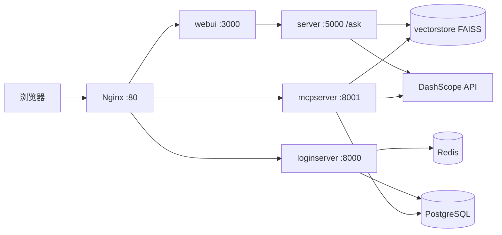

# LLM RAG 问答平台

基于 **阿里云百炼 DashScope（Qwen）** 与 **LangChain / LangGraph** 的 RAG（检索增强生成）系统：提供 Web 聊天、邮件验证码登录，以及对外暴露 **MCP（Model Context Protocol）** 检索工具，便于 IDE / Agent 复用同一套知识库与检索管线。

## 仓库结构

| 目录 | 说明 |
|------|------|
| `llm_common/` | 共享 Python 包：RAG 编排（`QwenRagService`）、向量库（FAISS）、嵌入与查询增强、DashScope 对话客户端、PostgreSQL / MCP JWT 相关 DAO |
| `server/` | Flask + Gunicorn：`/ask` 问答 API，挂载向量库与 PDF 目录 |
| `webui/` | Next.js 前端：对话 UI、登录与设置（含 MCP Token 配置说明） |
| `loginserver/` | FastAPI：邮箱验证码登录、Session、JWT；签发 MCP 所需配置（见 `MCP_SERVER_URL`） |
| `mcpserver/` | FastMCP：JWT 校验后暴露 `retrieve_rag_contexts` 等工具，与 Web 共用 `QwenRagService` 检索逻辑 |
| `nginx/` | 反向代理：`/` → WebUI，`/auth/` → loginserver，`/mcp` → mcpserver |
| `docker-compose.yml` | 本地/自建机：build 各服务镜像 |
| `docker-compose.aliyun.yml` | 云上：从 ACR 拉取预构建镜像 |
| `deploy-aliyun.sh` | 构建多镜像、推送 ACR、可选 SSH 同步 compose 并远程启动 |

## 架构概览



- **server** 与 **mcpserver** 均依赖项目根目录 `.env`（如 `DASHSCOPE_API_KEY`、嵌入相关配置）。
- **loginserver** / **mcpserver** 使用同一 **PostgreSQL**（用户会话、MCP JWT 密钥与 issuer/audience 等）。
- 浏览器通过 **同源** `/auth/*` 访问登录接口；MCP 客户端使用 **`https://你的域名/mcp`**（由 nginx 转发，compose 里用 `MCP_SERVER_URL` 写入返回给前端的配置）。

## 核心能力

- **RAG**：向量检索（FAISS）、**Query2Doc / HyDE 由 Agent 自动择一**：Web `/ask` 主链路在 LangGraph（`rag_graph`）的 `enhance_query` 节点调用 **`QueryEnhanceToolAgent`**（`llm_common.rag.query_enhance_agent`），由对话模型通过工具在 **Query2Doc**（假设文档片段 + 原问题 → 文本检索）与 **HyDE**（假设答案嵌入与原问题向量融合 → 向量检索）之间二选一；具体生成逻辑仍由 `query_enhance.py` 中的策略类实现。DashScope 对话与流式响应；编排集中在 `llm_common.rag`。
- **Web**：Next.js 通过服务端将问答请求转发到 Flask `FLASK_ASK_URL`（compose 内为 `http://server:5000/ask`）。
- **登录**：邮箱验证码 + Redis；Session 与业务数据走 PostgreSQL。
- **MCP**：RSA JWT 密钥首启写入数据库；`loginserver` 侧可为用户签发 token；`mcpserver` 校验 JWT 后返回 `contexts` / `prompt_context`。工具 **`retrieve_rag_contexts`** 仍通过参数 **`enhance_strategy`**（`query2doc` / `hyde`）**手动**指定增强方式，与 Web 主链路的 Agent 自动调度不同。

### Flask `/ask` 摘要

- `GET/POST /ask`，参数：`query`、`stream`（默认开启流式）、`trace`（可选；开启时轨迹中含 `retrieval_mode`：`text` 对应 Query2Doc 路径，`vector` 对应 HyDE 路径）。**不再**通过请求参数固定 `query2doc` / `hyde`，由图内 Agent 按问题自动选择。
- 流式响应为自定义二进制帧（魔数 `RAG\x01` + JSON 引用块 + 正文 token），详见 `server/ollama_qwen.py` 内注释。

本地开发亦可直接阅读 `server/ollama_qwen.py` 文件头说明。

## 环境变量（常见）

在项目**根目录**放置 `.env`（Docker 中 `server`、`mcpserver` 通过 `env_file` 加载）。以下为文档与代码中常见项，**以实际代码为准**。

| 变量 | 用途 |
|------|------|
| `DASHSCOPE_API_KEY` | 百炼 DashScope（对话等） |
| `DASHSCOPE_CHAT_MODEL` / `DASHSCOPE_VL_MODEL` / `DASHSCOPE_BASE_HTTP_API_URL` | 模型与地域基址（可选） |
| 嵌入相关 | 由 `EmbeddingProvider` 读取（可选用 Ollama 嵌入或 DashScope 多模态嵌入等，见 `llm_common.rag.embedding_provider`） |
| `MCP_SERVER_URL` | 登录服务返回给前端的 MCP 入口绝对 URL（生产应设为 `https://域名/mcp`） |
| `MCP_JWT_ISSUER` / `MCP_JWT_AUDIENCE` | MCP JWT 默认值（运行中可与 DB 中配置对齐） |

**loginserver** 另需 `REDIS_URL`、`PG_*`、可选 `SMTP_*`（发信验证码）；compose 已给出开发用默认值。

## 本地开发

### 1. Python 后端（RAG API）

```bash
cd /path/to/llm
python -m venv .venv
source .venv/bin/activate   # Windows: .venv\Scripts\activate
pip install -r server/requirements.txt
# 配置根目录 .env 后：
cd server
python ollama_qwen.py serve
```

默认 HTTP：`http://127.0.0.1:5000`。

### 2. 前端

```bash
cd webui
npm install
npm run dev
```

浏览器访问 `http://localhost:3000`。详见 [`webui/README.md`](webui/README.md)。

### 3. 登录服务 + 数据库（可选，全功能联调）

需本机 Redis、PostgreSQL，并设置与 `loginserver` 一致的 `PG_*`、`REDIS_URL`。示例：

```bash
cd loginserver
pip install -r requirements.txt
uvicorn loginserver:app --host 0.0.0.0 --port 8000 --reload
```

### 4. MCP 服务

```bash
pip install -e mcpserver   # 或按 mcpserver/pyproject.toml 安装
python -m llm_mcpserver.mcpserver
```

客户端测试可参考 `mcpserver/test_mcpclient.py`。

## Docker Compose（推荐一体运行）

在**仓库根目录**：

```bash
# 在仓库根目录创建 .env，至少配置 DASHSCOPE_API_KEY 等（与 server / mcpserver 共用）
docker compose up -d --build
```

- 对外入口：**Nginx `http://localhost:80`**
- loginserver 直接映射：`8000`（便于调试；生产通常只走 80）
- mcpserver：`8001`（生产 MCP 经 nginx `/mcp`）

持久化与数据目录：

- PostgreSQL：`loginserver_pg_data` 卷
- 向量库 / PDF：`./server/vectorstore`、`./server/pdf` 挂载到 server（mcpserver 挂载 `vectorstore` 以共用索引）

## 阿里云部署

1. 使用 `deploy-aliyun.sh` 在本地构建并推送 **webui / server / loginserver / mcpserver / nginx** 镜像到 ACR（需设置 `ACR_REGISTRY`、`ACR_NAMESPACE` 等；脚本内有注释示例）。
2. 在 ECS 上配置 `.env`、`MCP_SERVER_URL`（公网 HTTPS 域名 + `/mcp`）、`docker-compose.aliyun.yml` 与 `IMAGE_TAG`。
3. `docker compose -f docker-compose.aliyun.yml up -d`

推送镜像时若经 HTTP 代理出现 `broken pipe`，多为代理对大上传不稳定，可对 ACR 域名设 **NO_PROXY** 或关闭 Docker/系统代理后再 `docker push`。

## 技术栈摘要

- **后端**：Python 3.12、Flask、Gunicorn、FastAPI、Uvicorn、FastMCP、LangChain、LangGraph、FAISS、DashScope SDK  
- **数据**：Redis、PostgreSQL  
- **前端**：Next.js、React、TypeScript、Tailwind  
- **网关**：Nginx（限流、JSON access log、SSE/WebSocket 友好代理）

## 历史版本说明

- **v1.1.0**：新增 **用户登录**（`loginserver` FastAPI：邮箱验证码、会话/JWT，依赖 Redis 与 PostgreSQL；前端登录/登出与导航整合见 `webui`）；RAG 侧引入 **LangGraph** 进行图编排（`llm_common.rag.rag_graph` 中 `StateGraph`：检索、守卫、自检与重试等节点），替代此前仅基于 LangChain 链式组装的流程。其后在主问答链路中，**Query2Doc 与 HyDE** 改为由 **`QueryEnhanceToolAgent`**（工具型预置 Agent）按问题自动二择一，不再依赖 `/ask` 上的固定策略参数。
- **v1.0.0**：RAG 流程基于 **LangChain** 实现。

## 许可证与说明

本项目采用 `GPL-3.0-or-later` 开源协议，详见仓库根目录 `LICENSE`。  
使用 DashScope、Ollama 等外部服务时，请遵守各平台条款与计费规则。  
文档若与代码不一致，以当前仓库实现为准。
